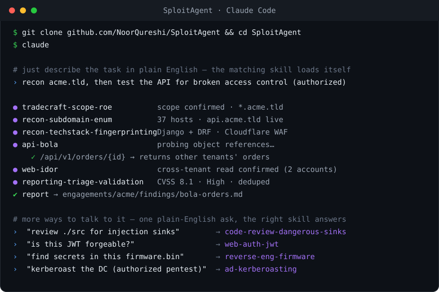

<div align="center">

# SploitAgent

**Security skills for AI agents.**
Give Claude Code (or any agent) senior-operator tradecraft — 127 skills across 20 domains, offense and defense, for **authorized** pentest, bug-bounty, and blue-team work.

[](https://github.com/NoorQureshi/SploitAgent/actions/workflows/ci.yml)


<sub>[Docs & site](https://noorqureshi.github.io/SploitAgent/) · [How it works](https://noorqureshi.github.io/SploitAgent/interact.html) · [Search skills](https://noorqureshi.github.io/SploitAgent/catalog.html) · [Contributing](CONTRIBUTING.md)</sub>



</div>

---

## What is this?

An AI agent is only as good as what it knows. **SploitAgent is that knowledge** — the security work
itself (find the bug, prove impact, escalate, pivot, report, defend) written as small, trigger-tagged
`SKILL.md` files an agent loads on demand.

- **You don't learn commands — you describe the task.** The agent matches your words to the right
  skill and follows its method.
- **Not a tool or scanner.** Plain Markdown: no runtime, no build step, no lock-in. Works with Claude
  Code, Codex, Gemini, or a local model.
- **Scope first, always.** Every engagement starts by confirming authorization and refuses anything
  out of scope.

## Quick start

```bash
# 1. Get it, and expose the skills to Claude Code everywhere (once)
git clone https://github.com/NoorQureshi/SploitAgent && cd SploitAgent
./sploit install

# 2. Make a workspace for your target — anywhere you like
sploit new acme.com ~/work/acme          # the folder gets the skills wired in

# 3. Open your agent inside that folder
cd ~/work/acme && claude                 # or: codex · gemini
```

Then just say what you want:

> **"Start an authorized assessment of acme.com. Confirm scope, then recon."**

That's it. The agent confirms your `scope.txt`, loads the matching skills, and works the loop.
The workspace is **self-contained** — it doesn't need to live inside the repo, and any agent opened
there can use the skills. New here? Read the **[full walkthrough](https://noorqureshi.github.io/SploitAgent/interact.html)**.

## Ask it things like…

| You say… | It loads |
|---|---|
| "recon acme.com and map the attack surface" | `recon-*` |
| "test this API for IDOR / BOLA (I'm authorized)" | `api-bola`, `web-idor` |
| "is this login's JWT forgeable?" | `web-auth-jwt` |
| "review ./src for injection sinks before we ship" | `code-review-*` |
| "I got a shell — what now?" | `privesc-enumeration` → `privesc-arsenal` |
| "kerberoast the DC (authorized pentest)" | `ad-kerberoasting` |
| "turn this finding into a report" | `reporting-triage-validation` → `reporting-*` |
| "write a Sigma rule to detect this" | `defense-detection-sigma` |

## How it works

Every engagement follows one loop; which skills fire is driven by what the target reveals.

```
Scope → Recon → Attack surface → Foothold → Escalate & pivot → Report → (Defend)
  │        │           │              │            │              │          │
  tradecraft recon-*   web/api/cloud  exploit-     privesc-*    reporting-* defense-*
  -scope-roe           /ad/wireless…  chaining     ad-* network-*
```

Work stays in a per-target workspace `sploit new` creates — **anywhere on disk**, with the skills and
operating guide wired in so any agent opened there can use them:

```
<your target folder>/
  scope.txt  roe.md  notes.md  findings/  loot/  START-HERE.md
  .claude/skills/   skills/   CLAUDE.md   AGENTS.md      # skills + guide, wired in
```

Full method: [`methodology.md`](methodology.md) · agent guide: [`AGENTS.md`](AGENTS.md).

## What's inside

**127 skills across 20 domains.** Search them all on the **[catalog page](https://noorqureshi.github.io/SploitAgent/catalog.html)**, or browse [CATALOG.md](CATALOG.md).

`web` · `api` · `cloud` · `ad` · `network` · `wireless` · `recon` · `mobile` · `ai-ml` ·
`code-review` · `reverse-engineering` · `cryptography` · `exploit-dev` · `privesc` · `payloads` ·
`defense` · `reporting` · `automation` · `tradecraft` · `social-eng`

<details>
<summary><b>Full coverage by domain</b></summary>

| Domain | # | Covers |
|---|:--:|---|
| [`web`](skills/web) | 36 | XSS, SQLi, SSRF, SSTI, IDOR, XXE, CSRF, CORS, LFI, deserialization, OAuth, SAML, request smuggling, prototype pollution, cache poisoning, host-header, clickjacking, WebSocket, race conditions, business logic, file upload, JWT, account takeover, dependency confusion, client-side signing reversal, authenticated session handling, Python sandbox escape, Cypher injection, JDBC/connection-string RCE |
| [`ai-ml`](skills/ai-ml) | 9 | Prompt injection, jailbreaks, RAG poisoning, model extraction, agent/tool and MCP abuse, insecure output handling, supply chain, unbounded consumption |
| [`cloud`](skills/cloud) | 9 | IMDS credential theft, object-storage exposure, Kubernetes, container escape, exposed Docker/daemon API abuse, IAM privilege escalation, registries, GCP, Azure / Entra ID |
| [`api`](skills/api) | 8 | BOLA/BFLA, GraphQL, gRPC, mass assignment, authentication attacks, fuzzing, version drift, NoSQL injection |
| [`recon`](skills/recon) | 8 | Subdomain enumeration, DNS analysis, content and JS discovery, OSINT, cloud-asset discovery, service enumeration, tech-stack fingerprinting |
| [`defense`](skills/defense) | 6 | Detection engineering (Sigma/ATT&CK), hardening baselines, DFIR triage, threat modeling, log analysis, purple teaming |
| [`code-review`](skills/code-review) | 6 | Methodology, dangerous-sink catalog, secrets detection, CI/CD security, Python, Node.js |
| [`mobile`](skills/mobile) | 5 | Android and iOS assessment, certificate-pinning bypass, deep-link abuse, WebView abuse |
| [`ad`](skills/ad) | 5 | Kerberoasting / AS-REP, ADCS (ESC1–8), ACL/DACL abuse, Kerberos delegation abuse (RBCD / S4U / coercion→relay), pivoting arsenal |
| [`network`](skills/network) | 6 | Service attacks, pivoting and tunneling, NTLM coercion and relay, password spraying and credential stuffing, perimeter appliance and VPN offensive, hash and credential cracking |
| [`wireless`](skills/wireless) | 2 | WPA2-PSK handshake/PMKID capture and cracking, evil-twin / rogue-AP enterprise (PEAP-MSCHAPv2) credential harvesting |
| [`privesc`](skills/privesc) | 4 | Post-foothold enumeration and credential hunting, Linux arsenal, GTFOBins (sudo/SUID/capabilities), Windows token impersonation |
| [`exploit-dev`](skills/exploit-dev) | 3 | Exploit chaining and impact amplification, PoC development, memory-corruption exploitation (ROP / format string / ret2libc) |
| [`reverse-engineering`](skills/reverse-engineering) | 3 | Native binary triage, deobfuscation (packed/JS/WASM/JSVMP), firmware extraction and analysis |
| [`cryptography`](skills/cryptography) | 2 | Weak/textbook RSA (JWT RS256, custom signatures), symmetric oracles (CBC padding, ECB, hash length extension) |
| [`payloads`](skills/payloads) | 4 | WAF/filter bypass, XSS polyglots, reverse shells and TTY upgrade, file transfers |
| [`reporting`](skills/reporting) | 3 | Finding triage and validation, bug-bounty write-up, penetration-test report |
| [`automation`](skills/automation) | 2 | Recon pipelines, custom nuclei templates |
| [`tradecraft`](skills/tradecraft) | 2 | Scope and rules of engagement, complex multi-stage engagements |
| [`social-eng`](skills/social-eng) | 4 | Authorized human-factor testing: methodology, phishing, vishing/pretexting, physical assessment (pentest-only) |

</details>

## Use it with other agents

<details>
<summary><b>Codex · Gemini · Ollama · any framework</b></summary>

The skills are plain Markdown, so any agent can use them. Clone the repo and open your agent inside
it — it reads [`AGENTS.md`](AGENTS.md), the tool-agnostic operating guide. For a one-off, paste a
single `SKILL.md` into the chat. To expose every skill to Claude Code across all projects, run
`./sploit install`. Per-agent setup (including an Ollama `Modelfile`) is in [docs/USING.md](docs/USING.md).

</details>

## Authorized use only

SploitAgent is for security work you are permitted to do: a signed pentest scope, a bug-bounty program
whose scope covers the target, or systems you own. The first skill in every engagement,
`tradecraft-scope-roe`, requires an explicit authorization envelope before anything runs. Don't point
it at systems you aren't authorized to test.

## Contributing

A contribution is a single Markdown file — no code:

```bash
cp skills/_templates/technique.md skills/<domain>/<slug>/SKILL.md
python3 tools/catalog.py            # validate + regenerate the indexes
```

Wanted skills are in [ROADMAP.md](ROADMAP.md); the full guide and house style are in
[CONTRIBUTING.md](CONTRIBUTING.md). Every PR is schema-validated by CI.

## Repository layout

```text
sploit                            front door: new <target> [dir] · install · list
install.sh                        link skills into ~/.claude/skills (Claude Code)
skills/<domain>/<slug>/SKILL.md   the library
engagements/<target>/             default workspace spot when run inside the repo (git-ignored;
                                  pass a path to `sploit new` to put it anywhere instead)
AGENTS.md · CLAUDE.md             operating guide read by any in-repo agent
methodology.md                    engagement loop, scope rule, note-taking standard
tools/catalog.py                  validation + index generation (schema in schemas/)
CATALOG.md · COVERAGE.md          generated indexes
docs/                             usage guide and project site
```

## License

[MIT](LICENSE). Built for authorized security work.
