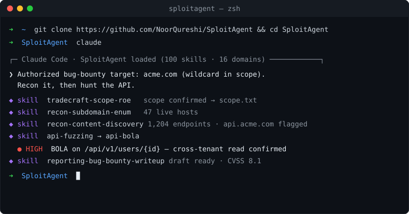

<div align="center">

# SploitAgent

**A security-skills library for AI agents — offensive and defensive, for authorized pentest, bug-bounty, and blue-team work.**

[](https://github.com/NoorQureshi/SploitAgent/actions/workflows/ci.yml)


<sub>[Documentation](https://noorqureshi.github.io/SploitAgent/) · [Catalog](CATALOG.md) · [Coverage](COVERAGE.md) · [Using](docs/USING.md) · [Contributing](CONTRIBUTING.md) · [Roadmap](ROADMAP.md)</sub>



</div>

---

## Overview

SploitAgent is a portable library of **103 security skills** an AI agent loads on demand. It is not a
scanner or a framework — it is the operating knowledge of the work itself (find the issue, prove the
impact, escalate, pivot, report, and defend) captured as small, trigger-tagged `SKILL.md` files in the
standard Agent-Skills format.

Any agent — Claude Code, Codex, Gemini, or a local model — reads a skill's trigger line, loads the one
that matches the task, and follows its method. The skills are plain Markdown: no runtime, no build step,
no lock-in. Each is mapped to OWASP, MITRE ATT&CK, and CWE, so coverage is measurable ([COVERAGE.md](COVERAGE.md)).

**Design principles**

- **Knowledge over tooling.** Skills encode *how to reason* — the mechanism, the exact command, the
  failure modes — which outlasts any individual tool or model version.
- **Offense and defense.** Every offensive class has its defensive counterpart: detection, hardening, DFIR.
- **Consistency by contract.** A JSON schema (`schemas/skill.schema.json`) validates every skill in CI.
- **Authorized use, enforced first.** Every engagement begins with scope confirmation.

## Quick start

<details open>
<summary><b>Claude Code</b></summary>

Open it in the repository — `CLAUDE.md` instructs the agent on how to use the library and to confirm
scope first:

```bash
git clone https://github.com/NoorQureshi/SploitAgent && cd SploitAgent
claude
```

Or expose the skills to every project once:

```bash
git clone https://github.com/NoorQureshi/SploitAgent
ln -s "$PWD/SploitAgent/skills" ~/.claude/skills/sploitagent
```
</details>

<details>
<summary><b>Codex, Gemini, and other agents</b></summary>

Clone the repository and open your agent inside it — it reads `AGENTS.md`, the tool-agnostic operating
guide. For a one-off, load a single `SKILL.md` into context.

```bash
git clone https://github.com/NoorQureshi/SploitAgent && cd SploitAgent
```
</details>

<details>
<summary><b>Local models and other frameworks</b></summary>

There is no runtime to install. Give the agent read access to `skills/` and `AGENTS.md`, or load the
specific `SKILL.md` for the task. Per-agent instructions, including an Ollama `Modelfile` that embeds
the operating guide, are in [docs/USING.md](docs/USING.md).
</details>

## Operating model

An agent works a target through a consistent loop and keeps its work in a per-engagement workspace.
The full method is in [`methodology.md`](methodology.md); the agent guide is [`AGENTS.md`](AGENTS.md).

```
1. Scope       confirm authorization; record scope.txt     → tradecraft-scope-roe
2. Recon       map the attack surface                       → recon-*
3. Attack      route by domain (web / api / cloud / ad / …) → web-*, api-*, cloud-*, …
4. Foothold    drive a weakness to proven impact            → exploit-chaining
5. Escalate    privilege escalation and lateral movement    → privesc-*, ad-*, network-*
6. Report      findings with severity and evidence          → reporting-*
7. Defend      convert findings into detections             → defense-*
```

```
engagements/<target>/
  scope.txt   roe.md   notes.md   findings/   loot/     # git-ignored — never committed
```

## Skill coverage

103 skills across 16 domains. The complete index is in [CATALOG.md](CATALOG.md).

| Domain | Skills | Coverage |
|---|:--:|---|
| [`web`](skills/web) | 32 | XSS, SQLi, SSRF, SSTI, IDOR, XXE, CSRF, CORS, LFI, deserialization, OAuth, SAML, request smuggling, prototype pollution, cache poisoning, host-header, clickjacking, WebSocket, race conditions, business logic, file upload, JWT, account takeover, dependency confusion, client-side signing reversal |
| [`ai-ml`](skills/ai-ml) | 9 | Prompt injection, jailbreaks, RAG poisoning, model extraction, agent/tool and MCP abuse, insecure output handling, supply chain, unbounded consumption |
| [`cloud`](skills/cloud) | 8 | IMDS credential theft, object-storage exposure, Kubernetes, container escape, IAM privilege escalation, registries, GCP, Azure / Entra ID |
| [`api`](skills/api) | 8 | BOLA/BFLA, GraphQL, gRPC, mass assignment, authentication attacks, fuzzing, version drift, NoSQL injection |
| [`recon`](skills/recon) | 7 | Subdomain enumeration, DNS analysis, content and JS discovery, OSINT, cloud-asset discovery, service enumeration |
| [`defense`](skills/defense) | 6 | Detection engineering (Sigma/ATT&CK), hardening baselines, DFIR triage, threat modeling, log analysis, purple teaming |
| [`code-review`](skills/code-review) | 6 | Methodology, dangerous-sink catalog, secrets detection, CI/CD security, Python, Node.js |
| [`mobile`](skills/mobile) | 5 | Android and iOS assessment, certificate-pinning bypass, deep-link abuse, WebView abuse |
| [`ad`](skills/ad) | 4 | Kerberoasting / AS-REP, ADCS (ESC1–8), ACL/DACL abuse, pivoting arsenal |
| [`network`](skills/network) | 4 | Service attacks, pivoting and tunneling, NTLM coercion and relay, password spraying and credential stuffing |
| [`privesc`](skills/privesc) | 3 | Linux arsenal, GTFOBins (sudo/SUID/capabilities), Windows token impersonation |
| [`exploit-dev`](skills/exploit-dev) | 2 | Exploit chaining and impact amplification, PoC development |
| [`payloads`](skills/payloads) | 2 | WAF/filter bypass, XSS polyglots |
| [`reporting`](skills/reporting) | 3 | Finding triage and validation, bug-bounty write-up, penetration-test report |
| [`automation`](skills/automation) | 2 | Recon pipelines, custom nuclei templates |
| [`tradecraft`](skills/tradecraft) | 2 | Scope and rules of engagement, complex multi-stage engagements |

## Skill format

Each skill is a single `SKILL.md`: a frontmatter block whose `description` is the load trigger, and a
body that explains the mechanism rather than pasting a payload.

```markdown
---
name: web-ssrf
description: Discover and escalate Server-Side Request Forgery. Load when the app
  fetches a URL you influence: webhooks, "import from URL", PDF/image rendering, …
domain: web
type: technique
modes: [pentest, bugbounty]
owasp: [A10:2021-SSRF]
cwe: [CWE-918]
---
## When it applies · Why it works · Method (exact commands) · Gotchas · Verify success
```

## Authorized use

SploitAgent is intended solely for authorized security work: penetration-testing engagements under a
signed scope, bug-bounty programs whose scope covers the target, and defensive assessment of systems
you own or operate. The first skill loaded in any engagement is `tradecraft-scope-roe`, which requires
an explicit authorization envelope before any activity. Do not use it against systems you are not
authorized to test.

## Contributing

Contributions are single Markdown files — no code required:

```bash
cp skills/_templates/technique.md skills/<domain>/<slug>/SKILL.md
python3 tools/catalog.py            # validate frontmatter and regenerate the indexes
```

Wanted skills are listed in [ROADMAP.md](ROADMAP.md) (entries marked as good first contributions).
The full guide, house style, and PR checklist are in [CONTRIBUTING.md](CONTRIBUTING.md). Every pull
request is schema-validated by CI.

## Repository layout

```text
skills/<domain>/<slug>/SKILL.md   the library
AGENTS.md · CLAUDE.md             operating guide read by any in-repo agent
methodology.md                    engagement loop, scope rule, note-taking standard
schemas/skill.schema.json         the skill contract (validated in CI)
tools/catalog.py                  validation and index generation
CATALOG.md · COVERAGE.md          generated indexes
docs/                             usage guide and project site
```

## License

[MIT](LICENSE).
