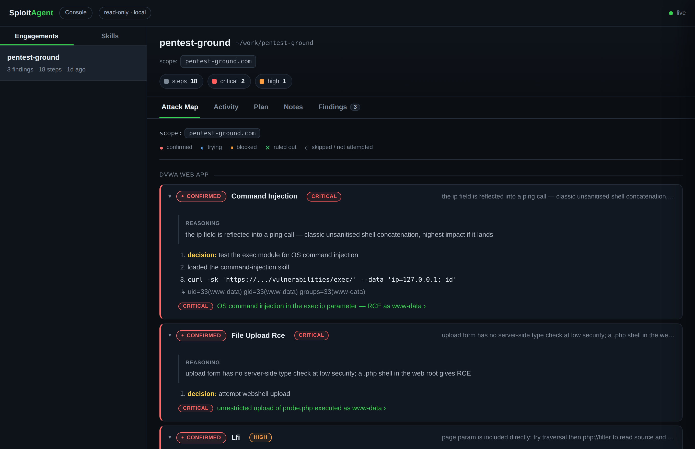
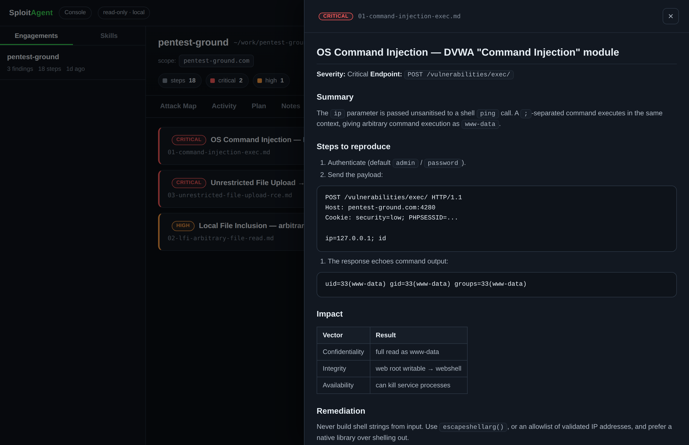
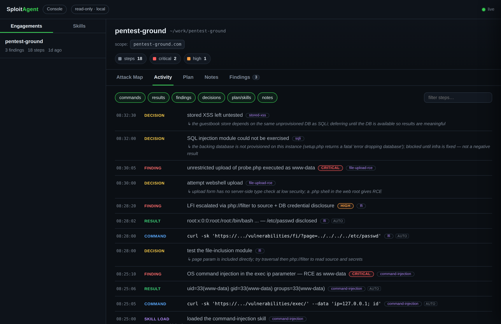

<div align="center">

# SploitAgent

**Security skills for AI agents.** A library of 159 security techniques (offensive + defensive) that
Claude Code — or any AI agent — loads on demand to work an **authorized** target from recon to report.

[](https://github.com/NoorQureshi/SploitAgent/actions/workflows/ci.yml)


<sub>[Docs & site](https://noorqureshi.github.io/SploitAgent/) · [How it works](https://noorqureshi.github.io/SploitAgent/interact.html) · [Search skills](https://noorqureshi.github.io/SploitAgent/catalog.html) · [Contributing](CONTRIBUTING.md)</sub>

</div>

```console
$ git clone https://github.com/NoorQureshi/SploitAgent && cd SploitAgent
$ ./sploit install                     # links the skills into Claude Code + sploit on PATH
$ sploit new acme.com ~/work/acme       # scaffold a workspace for your target (anywhere)
$ cd ~/work/acme && claude

  > Start an authorized assessment of acme.com. Confirm scope, then recon.

  ● tradecraft-scope-roe             scope confirmed · *.acme.tld (in scope)
  ● recon-techstack-fingerprinting   Django REST Framework · Cloudflare WAF
  ● api-bola                         probing object references on /api/v1/orders
      ✓ GET /api/v1/orders/1044  (account B's token)  →  returns account A's order
  ● web-idor                         confirmed cross-tenant read with 2 accounts
  ● reporting-triage-validation      CVSS 8.1 (High) · reproduced from a clean session
  ✔ wrote findings/idor-orders.md
```

<p align="center">
  
  <br>
  <sub>Run <code>sploit watch</code> and the console turns the engagement into an <b>Attack Map</b> —
  every lead, its status, <i>why</i> the agent chose it, and the proof. Read-only, runs locally.</sub>
</p>

## The idea in one minute

Your AI agent is a strong generalist, but it doesn't know the *exact method* for a specific job —
say, testing an API for access-control bugs. **SploitAgent is that missing know-how:** a binder of
159 short "how to do this one technique" pages the agent flips to when it needs one.

You describe the task in plain English. The agent picks the page that fits, follows it, proves the
bug, and writes it up — and it never touches anything outside the scope you set.

- **You give it:** plain English — *"test this API for access-control bugs, I'm authorized."*
- **You get back:** the technique run for real, impact proven, and findings + a report saved to a folder.
- **The guardrail:** it confirms authorization first and refuses anything outside your scope.

**A few words you'll see:**

| Term | Plain meaning |
|---|---|
| **skill** | one Markdown file that teaches one technique — `skills/<domain>/<slug>/SKILL.md` |
| **workspace** | a folder for one target; holds your `scope.txt`, notes, and findings |
| **scope** | the targets you're allowed to test — the hard boundary the agent won't cross |
| **lead** | one thing worth trying (e.g. "the login's JWT"); the agent works one lead at a time |
| **console** | the optional local web page from `sploit watch` that shows what the agent is doing |

No runtime, no build step, no lock-in — the skills are just Markdown the agent reads.

## Install

**Requirements:** an AI coding agent — [Claude Code](https://claude.com/claude-code) or [OpenCode](https://opencode.ai) (Codex, Gemini, or your own API script also work) — plus `git`, a terminal, and `python3` (only for the optional console).

```bash
git clone https://github.com/NoorQureshi/SploitAgent && cd SploitAgent
./sploit install
```

`./sploit install` does two things: links all 159 skills into `~/.claude/skills/` (so Claude Code
finds them in **any** directory) and puts the `sploit` command on your `PATH`. Undo anytime with
`./install.sh --uninstall`.

## Use

```bash
sploit new acme.com ~/work/acme     # 1. scaffold a workspace (put it anywhere)
cd ~/work/acme                      # 2. edit scope.txt with your authorized target(s)
sploit watch                        # 3. (optional) console in your browser — runs in the background
claude                              # 4. open your agent here: claude · opencode · codex · gemini
```

Then type your goal to the agent:

```
Start an authorized assessment of acme.com. Confirm scope, then recon.
```

**How the pieces fit — one terminal is enough:**

- Your **terminal** runs the agent. It's an interactive session, so it holds that tab while you work — that's normal for `claude`, `opencode`, etc.
- **`sploit watch` runs the console in the background** and opens it in your **browser**, so the same terminal stays free. Stop it with `sploit watch --stop`.
- Everything the agent does lands in the **workspace folder** — `scope.txt`, `plan.md`, `notes.md`, `findings/`. That folder is the source of truth, and what the console reads.
- Same flow with **Claude Code, OpenCode, Codex, Gemini, or your own API script** — they all read `AGENTS.md` and the skills; none of it is Claude-specific.

## What you get on disk

As the agent works (see the session up top), it writes everything into the workspace:

```text
~/work/acme/
  scope.txt                 your authorized targets (the hard boundary)
  notes.md                  timestamped log of every step (goal · command · result · why · next)
  findings/idor-orders.md   the confirmed finding, ready to submit
```

`findings/idor-orders.md` looks like this:

```markdown
# IDOR → cross-tenant order access on /api/v1/orders/{id}

Severity: High (CVSS 8.1 — AV:N/AC:L/PR:L/UI:N/S:U/C:H/I:N/A:N)
Asset:    https://api.acme.tld/api/v1/orders/{id}

## Steps to reproduce
1. Log in as attacker (account B) and capture the bearer token.
2. Request another tenant's order:  GET /api/v1/orders/1044  with B's token.
3. Response returns account A's order (name, address, line items).

## Impact
Any authenticated user can read any other tenant's orders by changing a sequential id
(~20k records enumerable). Cross-tenant confidentiality breach.

## Fix
Enforce object-level authorization: check the order's owner == the caller on every read.
```

That's the whole point: **you describe the task, the agent does the work and hands you evidence.**
See a fully annotated run → **[How it works](https://noorqureshi.github.io/SploitAgent/interact.html)**.

### Watch it work — the console

`sploit watch` opens a small **read-only** dashboard at `http://127.0.0.1:8787` in the background, so
your terminal stays free. It just reads the workspace on disk, so it works the same whichever agent
you run.

<p align="center">
  
  &nbsp;
  
</p>

- **Attack Map** — the whole engagement as a decision graph (shown up top): what was proved, ruled out, blocked, and skipped — and why.
- **Findings** — each confirmed issue rendered and ready to submit (left).
- **Activity** — a live, filterable timeline of every step, with the reasoning (right).
- **Plan · Notes** — the agent's strategy and running log, in readable form.

Under **Claude Code**, a bundled hook records commands automatically, so the console fills in even if
the agent doesn't log by hand. Stop it with `sploit watch --stop`.

## Common requests

| You type… | The agent loads |
|---|---|
| "recon acme.com and map the attack surface" | `recon-*` |
| "test this API for IDOR / BOLA (I'm authorized)" | `api-bola`, `web-idor` |
| "is this login's JWT forgeable?" | `web-auth-jwt` |
| "review ./src for injection bugs" | `code-review-*` |
| "I got a shell — what now?" | `privesc-enumeration` |
| "kerberoast the domain controller (authorized pentest)" | `ad-kerberoasting` |
| "turn this finding into a report" | `reporting-*` |
| "write a Sigma rule to detect this" | `defense-detection-sigma` |

## What's inside

**159 skills across 20 domains.** [🔎 Search them all](https://noorqureshi.github.io/SploitAgent/catalog.html) · or browse [CATALOG.md](CATALOG.md).

`web` · `api` · `cloud` · `ad` · `network` · `wireless` · `recon` · `mobile` · `ai-ml` ·
`code-review` · `reverse-engineering` · `cryptography` · `exploit-dev` · `privesc` · `payloads` ·
`defense` · `reporting` · `automation` · `tradecraft` · `social-eng`

<details>
<summary><b>See what each domain covers</b></summary>

| Domain | # | Covers |
|---|:--:|---|
| [`web`](skills/web) | 43 | XSS, SQLi, SSRF, SSTI, IDOR, XXE, CSRF, CORS, LFI, command injection, deserialization, OAuth, SAML, request smuggling, prototype pollution, cache poisoning, cache deception, host-header, clickjacking, CSP bypass, DOM clobbering, HTTP parameter pollution, postMessage, WebSocket, race conditions, business logic, file upload, JWT, 2FA/MFA bypass, account takeover, dependency confusion, client-side signing reversal, authenticated session handling, Python sandbox escape, Cypher injection, JDBC/connection-string RCE |
| [`ai-ml`](skills/ai-ml) | 9 | Prompt injection, jailbreaks, RAG poisoning, model extraction, agent/tool and MCP abuse, insecure output handling, supply chain, unbounded consumption |
| [`cloud`](skills/cloud) | 9 | IMDS credential theft, object-storage exposure, Kubernetes, container escape, exposed Docker/daemon API abuse, IAM privilege escalation, registries, GCP, Azure / Entra ID |
| [`api`](skills/api) | 8 | BOLA/BFLA, GraphQL, gRPC, mass assignment, authentication attacks, fuzzing, version drift, NoSQL injection |
| [`recon`](skills/recon) | 9 | Subdomain enumeration, DNS analysis, content and JS discovery, OSINT, GitHub code-leak discovery, cloud-asset discovery, service enumeration, tech-stack fingerprinting |
| [`defense`](skills/defense) | 13 | Detection engineering (pipeline + Sigma/ATT&CK), threat hunting, incident response, DFIR triage, network detection (NSM), cloud detection & response, Active Directory defense, malware triage, hardening baselines, threat modeling, log analysis, purple teaming |
| [`code-review`](skills/code-review) | 15 | Methodology, dangerous-sink catalog, secrets detection, CI/CD security, IaC (Terraform/Ansible/K8s), smart contracts (Solidity), Python, Node.js, PHP, Java/Spring, Go, Ruby/Rails, .NET/C#, C/C++, Rust |
| [`mobile`](skills/mobile) | 5 | Android and iOS assessment, certificate-pinning bypass, deep-link abuse, WebView abuse |
| [`ad`](skills/ad) | 5 | Kerberoasting / AS-REP, ADCS (ESC1–8), ACL/DACL abuse, Kerberos delegation abuse (RBCD / S4U / coercion→relay), pivoting arsenal |
| [`network`](skills/network) | 6 | Service attacks, pivoting and tunneling, NTLM coercion and relay, password spraying and credential stuffing, perimeter appliance and VPN offensive, hash and credential cracking |
| [`wireless`](skills/wireless) | 2 | WPA2-PSK handshake/PMKID capture and cracking, evil-twin / rogue-AP enterprise (PEAP-MSCHAPv2) credential harvesting |
| [`privesc`](skills/privesc) | 4 | Post-foothold enumeration and credential hunting, Linux arsenal, GTFOBins (sudo/SUID/capabilities), Windows token impersonation |
| [`exploit-dev`](skills/exploit-dev) | 3 | Exploit chaining and impact amplification, PoC development, memory-corruption exploitation (ROP / format string / ret2libc) |
| [`reverse-engineering`](skills/reverse-engineering) | 3 | Native binary triage, deobfuscation (packed/JS/WASM/JSVMP), firmware extraction and analysis |
| [`cryptography`](skills/cryptography) | 2 | Weak/textbook RSA (JWT RS256, custom signatures), symmetric oracles (CBC padding, ECB, hash length extension) |
| [`payloads`](skills/payloads) | 4 | WAF/filter bypass, XSS polyglots, reverse shells and TTY upgrade, file transfers |
| [`reporting`](skills/reporting) | 5 | Finding triage and validation, bug-bounty write-up, penetration-test report, CVSS/severity scoring, triage communication |
| [`automation`](skills/automation) | 2 | Recon pipelines, custom nuclei templates |
| [`tradecraft`](skills/tradecraft) | 8 | Scope and rules of engagement, attack-scenario planning, attack-path mapping, pivot/decision-making across skills, target selection, duplicate avoidance, bug-bounty platform intelligence, complex multi-stage engagements |
| [`social-eng`](skills/social-eng) | 4 | Authorized human-factor testing: methodology, phishing, vishing/pretexting, physical assessment (pentest-only) |

</details>

## FAQ

<details>
<summary><b>Do I need to install security tools?</b></summary>

The skills are the *method* and name the standard tools each step uses (nmap, ffuf, sqlmap, impacket…).
Install what a given skill calls for when you need it; the agent runs them in your terminal.
</details>

<details>
<summary><b>Which agents work, and does the workspace have to be in this repo?</b></summary>

Claude Code works best (it auto-loads the matching skill). Codex, Gemini, and local models work too —
they read `AGENTS.md` and the skill files. Workspaces can live **anywhere**: `sploit new <target> <path>`
wires the skills in; add `--copy` to make the folder fully standalone.
</details>

<details>
<summary><b>Will it attack things on its own?</b></summary>

No. The first skill in every engagement, `tradecraft-scope-roe`, makes the agent confirm authorization
and refuse anything not in your `scope.txt`. You stay in control.
</details>

## Authorized use only

For security work you're **permitted** to do — a signed pentest scope, a bug-bounty program that lists
the target, or systems you own. Don't point it at anything you aren't authorized to test.
See **[SECURITY.md](SECURITY.md)** for the full policy and how to privately report a vulnerability in
SploitAgent itself.

## Contribute

A contribution is a single Markdown file — no code:

```bash
cp skills/_templates/technique.md skills/<domain>/<slug>/SKILL.md
python3 tools/catalog.py            # regenerate CATALOG.md, COVERAGE.md, docs/skills.json
./tools/check.sh                    # run everything CI runs, before you push
```

Wanted skills: [ROADMAP.md](ROADMAP.md) · full guide: [CONTRIBUTING.md](CONTRIBUTING.md) ·
[Code of Conduct](CODE_OF_CONDUCT.md). Every PR is schema-validated by CI.

## Repository layout

```text
sploit                            front door: new <target> [dir] · install · watch · list
install.sh                        link skills into ~/.claude/skills (Claude Code)
skills/<domain>/<slug>/SKILL.md   the library
tools/console/                    the read-only `sploit watch` dashboard (stdlib, local)
AGENTS.md · CLAUDE.md             operating guide read by any in-repo agent
methodology.md                    engagement loop, scope rule, note-taking standard
tools/catalog.py                  validation + index generation (schema in schemas/)
CATALOG.md · COVERAGE.md          generated indexes
docs/                             usage guide and project site
```

## License

[MIT](LICENSE). Built for authorized security work.
